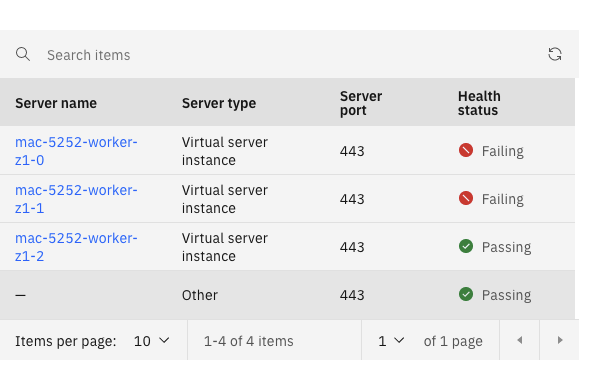

# ocp4-upi-compute-powervs-ibmcloud

The [`ocp4-upi-compute-powervs-ibmcloud` project](https://github.com/ibm/ocp4-upi-compute-powervs-ibmcloud) provides Terraform based automation code to add workers to [IBM® Power Systems™ Virtual Server on IBM Cloud](https://www.ibm.com/cloud/power-virtual-server) with the deployment of OpenShift Container Platform (OCP) 4.x compute workers on [IBM Cloud® Virtual Private Cloud (VPC)](https://www.ibm.com/cloud/vpc).

## Prerequisites

1. Requires Terraform v1.5.0 or Higher
2. An Existing OpenShift Container Platform Cluster installed on IBM Power Virtual Server (PowerVS)
- The cluster must be installed with Transit Gateway enabled with a Power Edge Router Connection
- The cluster must have the NFS Storage Provider installed.
3. An Existing IBM Cloud Virtual Private Computing (VPC) setup with at least one subnet with a Public Gateway
4. IAM Authorization configured:

- Navigate to https://cloud.ibm.com/iam/authorizations/grant
- Source: `VPC Infrastructure Services service` - `resourceType string equals image`
- Target: `Cloud Object Storage service`
- Click Create


## Commands

### Init 

```
❯ terraform init -upgrade
```

### Plan

```
❯ terraform plan -var-file=var.tfvars
```

Note: The PowerVS and IBMCloud VPC regions must be compatible.

### Apply 

```
❯ terraform apply -var-file=var.tfvars
```

### Destroy

```
❯ terraform destroy -var-file=var.tfvars
```

Note, the `destroy` command removes the Node resource, removes the NFS deployment, and destroys the virtual servers. Please backup your NFS Server first - it is destroyed.

## Cluster Details

There are some important points to mention:

1. NFS is used as the storage provider across nodes.

## Running Automation from another IBMCloud VPC

To run the code, you'll need to set the MTU for your machine: 

```
ip link set eth0 mtu 1400
```

### Getting the IPs of Intel Workers

To get the IPs of the Power Workers. 

```
❯ oc get nodes -l 'kubernetes.io/arch=amd64' -owide
NAME                STATUS   ROLES    AGE   VERSION           INTERNAL-IP      EXTERNAL-IP   OS-IMAGE                                                       KERNEL-VERSION                  CONTAINER-RUNTIME
mac-d263-worker-0   Ready    worker   40h   v1.27.4+4e87926   192.168.200.10   <none>        Red Hat Enterprise Linux CoreOS 414.92.202308151250-0 (Plow)   5.14.0-284.25.1.el9_2.ppc64le   cri-o://1.27.1-6.rhaos4.14.gitc2c9f36.el9
```

### Frequently Asked Questions (FAQ)

Q: I am using the VPC Load Balancers. The Load Balancers internal-loadbalancer/external-loadbalancer ingress-http/ingress-https report failed members, like this:

A: The installation uses a platform type of none. When a Platform Type of none is set, the IngressController can be scaled up to match the number of nodes on your cluster, or tweaked to match where you want Ingress to the cluster to pass-through.

You can learn more about scalling up the ingress controller at [`Scaling an Ingress Controller`](https://docs.openshift.com/container-platform/4.14/networking/ingress-operator.html#nw-ingress-controller-configuration_configuring-ingress)

```
$ oc patch -n openshift-ingress-operator ingresscontroller/default --patch '{"spec":{"replicas": 3}}' --type=merge
```

Q: The execution reports `No route to host` during setup of the cluster. I see:

> module.install.null_resource.bootstrap_config (remote-exec): fatal: [syd05-bootstrap]: FAILED! => {"changed": false, "elapsed": 2718, "msg": "timed out waiting for ping module test: Data could not be sent to remote host \"syd05-bootstrap\". Make sure this host can be reached over ssh: ssh: connect to host syd05-bootstrap port 22: No route to host\r\n"}

A: This indicates an issue with the networking routes. Please work with support to confirm your routes.

Q: Do I need add images to my PowerVS workspace?

A: Yes, as part of the setup, you will import from the RHCOS bucket.

To import rhcos:

```
ibmcloud pi image-import rhcos-415-92-202312071243-t1
       --bucket-access public --storage-pool Tier1-Flash-1
       --bucket rhcos-powervs-images-us-east --region us-east --job --json --os-type rhel
       --image-file-name rhcos-415-92-202312071243-0-ppc64le-powervs.ova.gz
```

To import the Centos stock image:

```
ibmcloud pi image-create CentOS-Stream-8
```

## Contributing

If you have any questions or issues you can create a new [issue here][issues].

Pull requests are very welcome! Make sure your patches are well tested.
Ideally create a topic branch for every separate change you make. For
example:

1. Fork the repo
2. Create your feature branch (`git checkout -b my-new-feature`)
3. Commit your changes (`git commit -am 'Added some feature'`)
4. Push to the branch (`git push origin my-new-feature`)
5. Create new Pull Request

## License

All source files must include a Copyright and License header. The SPDX license header is 
preferred because it can be easily scanned.

If you would like to see the detailed LICENSE click [here](LICENSE).

```text
#
# Copyright 2023 - IBM Corporation. All rights reserved
# SPDX-License-Identifier: Apache-2.0
#
```

# Support
Is this a Red Hat or IBM supported solution?

No. This is only an early alpha version of multi-architecture compute.

This notice will be removed when the feature is generally available or in Tech Preview. 
